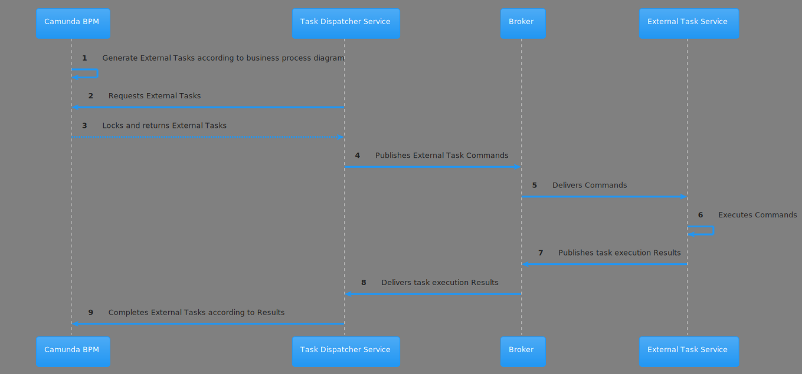

# Camunda External Task Dispatcher component design

There are 4 actors in External Task processing:
- Camunda BPM - source and end consumer of External Tasks
- Task Dispatcher Service - responsible for requesting and delivering tasks to Camunda BPM
- Message Broker - serving for message queues handling
- External Task Service - responsible for task executing and result generating
## External Task execution routine

## Components
### camunda-task-dispatcher-api
Contains annotations for External Task to class-model mapping and base interfaces
### camunda-task-dispatcher-runtime
Spring Boot app which is responsible for External Task requesting from Camunda BPM REST API
### camunda-task-dispatcher-processor
Runtime for External Task Command routing in External Task Service like services
### camunda-task-dispatcher-receiver-jms
Receives External Task Command by JMS protocol and calls camunda-task-dispatcher-processor runtime for routing Command to External Task Command Processor
### camunda-task-dispatcher-completer-jms
Sends by JMS protocol result of External Task Command processing
### camunda-task-dispatcher-transport-jms
Sends and receives External Task Command and its result by JMS protocol
### camunda-task-dispatcher-mapper-json
Serializes and deserializes External Task Command in JSON format
### camunda-task-dispatcher-mapper-xml
Serializes and deserializes External Task Command in XML format
### camunda-task-dispatcher-util
Common and util code
### camunda-task-dispatcher-example-model
Example of Command-class and relate models
### camunda-task-dispatcher-example-bpm
Example of BPMN process
### camunda-task-dispatcher-example-jms-json
Example of External Task dispatcher and processor using JMS as protocol and JSON as format
### camunda-task-dispatcher-example-jms-xml
Same as camunda-task-dispatcher-example-jms-json, but XML is a Command serialization format